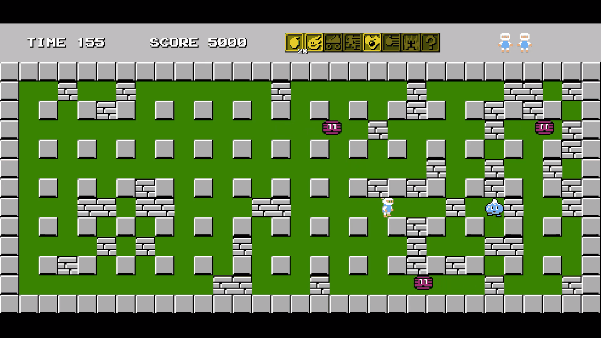

# **Bomberman Game Clone**

Made for our second semester project in an Advanced C++ class. 
Clone of original 1983 Bomberman game made with SFML and Visual Studio. 
Windows exclusive, compatable with keyboard and Xbox controllers.

## **Preview**
<table>
  <tr>
    <td align="center">
      <h3>Chain Reactions</h3>
      
    </td>
    <td align="center">
      <h3>Powerups</h3>
      
    </td>
  </tr>
</table>

## **Objective**
Traverse through 50 levels defeating enemies and collecting powerups. 
Cannot enter level exit until all enemies are defeated. 
Blowing up the exit or powerup will spawn more enemies to defeat.

## **Controls**
### **Keyboard**
+ Arrow keys - Move
+ Z - Place bomb
+ X - Explode bomb (remote)
+ Enter - Start/Pause

### **Controller**
+ Left stick - Move
+ //// - Place bomb
+ //// - Explode bomb (remote)
+ //// - Start/Pause

## **Setup**
1. Install [SFML 3.x](https://www.sfml-dev.org/download/sfml/3.0.0/) 32-bit.
2. Place folder in C drive, named SFML.
3. Clone repo into Visual Studio using provided Git copier.
4. Run on x86.

## **Contributors**
&emsp;Team lead: **Tyson Francis**  
&emsp;Developers: **Dylan Fletcher, Emery Chiang, Henry Steele**

## **Resources used**
+ [Emulator](https://emulatorgamer.com/games/bomberman/play) 
+ [Game info](https://randomhoohaas.flyingomelette.com/bomb/nes-1/game.html) 
+ [Audio download](https://downloads.khinsider.com/game-soundtracks/album/bomberman-nes) 
+ [SFML tutorials](https://www.sfml-dev.org/tutorials/3.0/)
